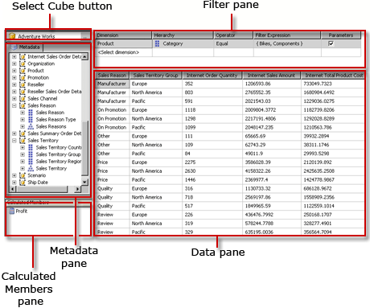
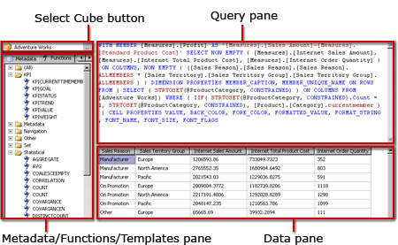

# Analysis Services MDX Query Designer (PowerPivot)
  The Analysis Services Multidimensional Expression (MDX) query designer provides a graphical user interfaces to help you create MDX queries for a [!INCLUDE[msCoName](../includes/msconame-md.md)] [!INCLUDE[ssNoVersion](../includes/ssnoversion-md.md)] [!INCLUDE[ssASnoversion](../includes/ssasnoversion-md.md)] data source. The MDX graphical query designer has two modes: design mode and query mode. Each mode provides a metadata pane from which you can drag members from the selected cubes to build an MDX query that retrieves the data you want to use.  
  
> [!IMPORTANT]  
>  Users access data sources when they create and run queries. You should grant minimal permissions on the data sources, such as read-only permissions.  
  
 The following sections describe the toolbar buttons and query designer panes for each mode of the graphical query designer.  
  
## Graphical MDX Query Designer in Design Mode  
 When you edit an MDX query, the graphical MDX query designer opens in Design mode.  
  
 The following figure labels the panes for Design mode.  
  
   
  
 The following table lists the panes in this mode:  
  
|Pane|Function|  
|----------|--------------|  
|Select Cube button (**...**)|Displays the currently selected cube.|  
|Metadata pane|Displays a hierarchical list of measures, Key Performance Indicators (KPIs), and dimensions defined on the selected cube.|  
|Calculated Members pane|Displays the currently defined calculated members available for use in the query.|  
|Filter pane|Use to choose dimensions and related hierarchies to filter data at the source and limit data returned.|  
|Data pane|Displays the column headings for the result set as you drag items from the Metadata pane and the Calculated Members pane. Automatically updates the result set if the **AutoExecute** button is selected.|  
  
 You can drag dimensions, measures, and KPIs from the Metadata pane, and calculated members from the Calculated Member pane, onto the Data pane. In the Filter pane, you can select dimensions and related hierarchies, and set filter expressions to limit the data available to query. If the **AutoExecute** () toggle button on the toolbar is selected, the query designer runs the query every time that you drop a metadata object onto the Data pane. You can manually run the query using the **Run** () button on the toolbar.  
  
 When you create an MDX query in this mode, the following additional properties are automatically included in the query:  
  
 **Member Properties** MEMBER_CAPTION, MEMBER_UNIQUE_NAME  
  
 **Cell Properties** VALUE, BACK_COLOR, FORE_COLOR, FORMATTED_VALUE, FORMAT_STRING, FONT_NAME, FONT_SIZE, FONT_FLAGS  
  
 To specify your own additional properties, you must manually edit the MDX query in Query mode.  
  
 Importing an .mdx query from a file is not supported.  
  
> [!NOTE]  
>  For more information about MDX and general information about the MDX query designer, see "MDX Query Editor (Analysis Services - Multidimensional Data)" in [SQL Server Books Online](https://go.microsoft.com/fwlink/?linkid=98335).  
  
### Graphical MDX Query Designer Toolbar in Design Mode  
 The query designer toolbar provides buttons to help you design MDX queries using the graphical interface. The following table lists the buttons and their functions.  
  
|Button|Description|  
|------------|-----------------|  
|**Edit As Text**|Not enabled for this data source type.|  
|**Import**|Import an existing query from a report definition (.rdl) file on the file system.|  
||Switch to Command Type MDX.|  
||Refresh metadata from the data source.|  
||Display the **Calculated Member Builder** dialog box.|  
||Toggle between showing and not showing empty cells in the Data pane. (This is the equivalent to using the NON EMPTY clause in MDX).|  
||Automatically run the query and show the result every time a change is made. Results are shown in the Data pane.|  
||Show aggregations in the Data pane.|  
||Delete the selected column in the Data pane from the query.|  
||Display the **Query Parameters** dialog box. When you specify values for a query parameter, a parameter with the same name is automatically created.|  
||Prepare the query.|  
||Run the query and display the results in the Data pane.|  
||Cancel the query.|  
||Toggle between Design mode and Query mode.|  
  
## Graphical MDX Query Designer in Query Mode  
 To change the graphical query designer to **Query** mode, click the **Design Mode** button on the toolbar.  
  
 The following figure labels the panes for Query mode.  
  
   
  
 The following table lists the panes in this mode:  
  
|Pane|Function|  
|----------|--------------|  
|Select Cube button (**...**)|Displays the currently selected cube.|  
|Metadata/Functions/Templates pane|Displays a hierarchical list of measures, KPIs, and dimensions defined on the selected cube.|  
|Query pane|Displays the query text.|  
|Result pane|Displays the results of running the query.|  
  
 The Metadata pane displays tabs for **Metadata**, **Functions**, and **Templates**. From the **Metadata** tab, you can drag dimensions, hierarchies, KPIs, and measures onto the MDX Query pane. From the **Functions** tab, you can drag functions onto the MDX Query pane. From the **Templates** tab, you can add MDX templates to the MDX Query pane. When you execute the query, the Result pane displays the results for the MDX query.  
  
 You can extend the default MDX query generated in Design mode to include additional member properties and cell properties. When you run the query, these values do not appear in the result set. However, they are passed back with the dataset field collection and you can use these values.  
  
### Graphical Query Designer Toolbar in Query Mode  
 The query designer toolbar provides buttons to help you design MDX queries using the graphical interface.  
  
 The toolbar buttons are identical between Design mode and Query mode, but the following buttons are not enabled for Query mode:  
  
-   **Edit As Text**  
  
-   **Add Calculated Member** ()  
  
-   **Show Empty Cells** ()  
  
-   **AutoExecute** ()  
  
-   **Show Aggregations** ()  
  
  
