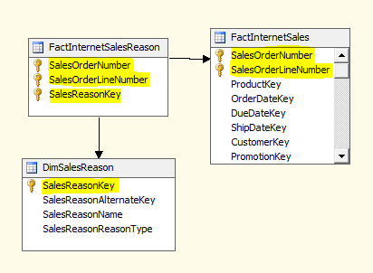
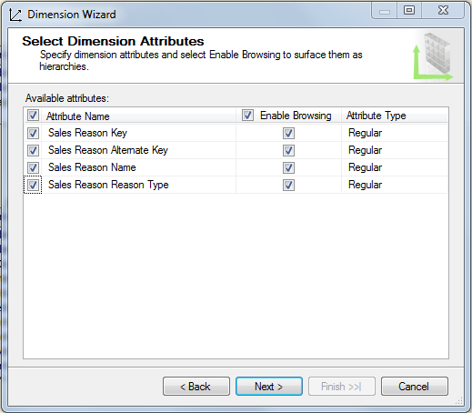
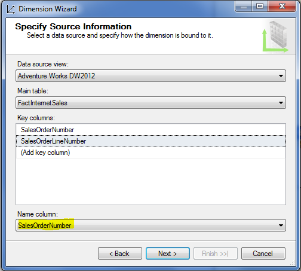
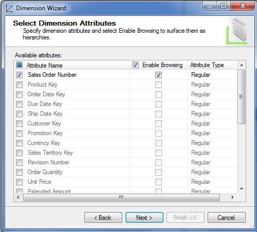
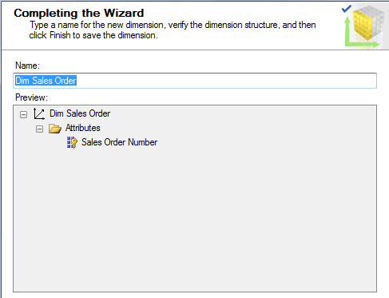

# Define a Many-to-Many Relationship and Many-to-Many Relationship Properties
  This topic explains many-to-many dimensions in Analysis Services, including when to use them and how to create them.  
  
## Introduction  
 Analysis Services supports many-to-many dimensions, allowing for more complex analytics than what can be described in a classic star schema. In a classic star schema, all dimensions have a one-to-many relationship with a fact table. Each fact joins to one dimension member; a single dimension member is associated with many facts.  
  
 Many-to-many removes this modeling restriction by enabling a fact (such as an account balance) to be associated with multiple members of the same dimension (the balance of a joint account can be attributed to two or more owners of a joint account).  
  
 Conceptually, a many-to-many dimensional relationship in Analysis Services is equivalent to many-to-many relationships in a relational model, supporting the same kinds of scenarios. Common examples of many-to-many include:  
  
-   Students are enrolled in many courses; each course has many students.  
  
-   Doctors have many patients; patients have many doctors.  
  
-   Customers have many bank accounts; bank accounts might belong to more than one customer.  
  
-   In Adventure Works, many customers have many reasons for ordering a product, and a sales reason can be associated with many orders.  
  
 Analytically, the problem that a many-to-many relationship solves is accurate representation of a count or sum relative to the dimensional relationship (usually by eliminating double-counts when performing calculations for a specific dimension member). An example is necessary to clarify this point. Consider a product or service that belongs to more than one category. If you were counting the number of services by category, you would want a service belonging to both categories to be included in each one. At the same time, you would not want to overstate the number of services that you provide. By specifying the many-to-many dimensional relationship, you are more likely to get the correct results back when querying by category or by service. However, thorough testing is always necessary to ensure that this is the case.  
  
 Structurally, creating a many-to-many dimensional relationship is similar to how you might create many-to-many in a relational data model. Whereas a relational model uses a *junction table* to store row associations, a multidimensional model uses an *intermediate measure group*. Intermediate measure group is the term we use to refer to a table that maps members from different dimensions.  
  
 Visually, a many-to-many dimensional relationship is not indicated in a cube diagram. Instead, use the Dimension Usage tab to quickly identify any many-to-many relationships in a model. A many-to-many relationship is indicated by the following icon.  
  
   
  
 Click the button to open the Define Relationship dialog box to verify the relationship type is many-to-many, and to view which intermediate measure group is used in the relationship.  
  
   
  
 In subsequent sections, you will learn how to set up a many-to-many dimension and test model behaviors. If you would rather review additional information or try tutorials first, see **Learn More** at the end of this article.  
  
## Create a many-to-many dimension  
 A simple many-to-many relationship includes two dimensions having a many-to-many cardinality, an intermediate measure group for storing member associations, and a fact measure group containing measurable data, such as sum of total sales or the balance of a bank account.  
  
 Dimensions in a many-to-many relationship might have correspondent tables in the DSV, where each dimension in the model is based on an existing table in a data source. Conversely, the dimensions in your model might derive from fewer or different physical tables in the DSV. Using Sales Reasons and Sales Orders as a case in point, the Adventure Works sample cube demonstrates a many-to-many relationship using dimensions that exist as model-only data structures, without physical counterparts in the DSV. The Sales Order dimension is based on a fact table, rather than a dimension table, in the underlying data source.  
  
 The next procedure assumes that you already know which entities participate in the many-to-many relationship. See **Learn More** for further study.  
  
 To illustrate the steps used to create a many-to-many relationship, this procedure re-creates one of the many-to-many relationships in the Adventure Works sample cube. If you have the source data (that is, the Adventure Works sample data warehouse) installed on a relational database engine instance, you can follow these steps.  
  
#### Step 1: Verify DSV relationships  
  
1.  In SQL Server Data Tools, in a multidimensional project, create a data source to the Adventure Works DW 2012 relational data warehouse, hosted on a SQL Server Database Engine instance.  
  
2.  Create a Data Source View using the following existing tables:  
  
    -   FactInternetSales  
  
    -   FactInternetSalesReason  
  
    -   DimSalesReason  
  
3.  Verify that all of the tables you plan to use in the many-to-many relationships are related in the DSV through primary key relationships. This is a requirement for establishing a link to the intermediate measure group in a subsequent step.  
  
    > [!NOTE]  
    >  If the underlying data source does not provide primary and foreign key relationships, you can create the relationships manually in the DSV. For more information, see [Define Logical Relationships in a Data Source View &#40;Analysis Services&#41;](define-logical-relationships-in-a-data-source-view-analysis-services.md).  
  
     The following example confirms that the tables used in this procedure are linked using primary keys.  
  
       
  
#### Step 2: Create dimensions and measure groups  
  
1.  In SQL Server Data Tools, in a multidimensional project, right-click **Dimensions** and select **New Dimension**.  
  
2.  Create a new dimension based on existing table, **DimSalesReason**. Accept all of the default values when specifying the source.  
  
     For attributes, select all.  
  
       
  
3.  Create a second dimension based on existing table, Fact Internet Sales. Although this is a fact table, it contains Sales Order information. We'll use it to build a Sales Order dimension.  
  
4.  In Specify Source Information, you will see a warning that indicates a Name column must be specified. Choose **SalesOrderNumber** as the Name.  
  
       
  
5.  On the next page of the wizard, choose the attributes. In this example, you can select just **SalesOrderNumber**.  
  
       
  
6.  Rename the dimension to **Dim Sales Orders**, so that you have a consistent naming convention for the dimensions.  
  
       
  
7.  Right-click **Cubes** and select **New Cube**.  
  
8.  In measure group tables, choose **FactInternetSales** and **FactInternetSalesReason**.  
  
     You are choosing **FactInternetSales** because it contains the measures you want to use in the cube. You are choosing **FactInternetSalesReason** because it is the intermediate measure group, providing member association data that relates sales orders to sales reasons.  
  
9. Choose measures for each fact table.  
  
     To simplify your model, clear all the measures, and then select just **Sales Amount** and **Fact Internet Sales Count** at the bottom of the list. The **FactInternetSalesReason** only has one measure, so it is selected for you automatically.  
  
10. In the dimension list, you should see **Dim Sales Reason** and **Dim Sales Orders**.  
  
     In the Select New Dimensions page, the wizard prompts you to create a new dimension for **Fact Internet Sales Dimension**. You do not need this dimension, so you can clear it from the list.  
  
11. Name the cube and click **Finish**.  
  
#### Step 3: Define Many-to-Many relationship  
  
1.  In cube designer, click Dimension Usage tab. Notice that there is already a many-to-many relationship between **Dim Sales Reason** and **Fact Internet Sales**. Recall that the following icon indicates a many-to-many relationship.  
  
       
  
2.  Click on the intersection cell between **Dim Sales Reason** and **Fact Internet Sales**, and then click the button to open the Define Relationship dialog box.  
  
     You can see that this dialog box is used to specify a many-to-many relationship. If you were adding dimensions that had a regular relationship instead, you would use this dialog box to change it to many-to-many.  
  
       
  
3.  Deploy the project to an Analysis Services multidimensional instance. In the next step, you will browse the cube in Excel to verify its behaviors.  
  
## Testing Many-to-Many  
 When you define a many-to-many relationship in a cube, testing is imperative to ensure queries return expected results. You should test the cube using the client application tool that will be used by end-users. In this next procedure, you will use Excel to connect to the cube and verify query results.  
  
#### Browse the cube in Excel  
  
1.  Deploy the project and then browse the cube to confirm the aggregations are valid.  
  
2.  In Excel, click **Data** | **From Other Sources** | **From Analysis Services**. Enter the name of the server, choose the database and cube.  
  
3.  Create a PivotTable that uses the following:  
  
    -   **Sales Amount** as the Value  
  
    -   **Sales Reason Name** on Columns  
  
    -   **Sales Order Number** on Rows  
  
4.  Analyze the results. Because we are using sample data, the initial impression is that all sales orders have identical values. However, if you scroll down, you begin to see data variation.  
  
     Part way down, you can find the sales amount and sales reasons for order number **SO5382**. Grand total of this particular order is **539.99**, and the purchase reasons attributed to this order include Promotion, Other and Price.  
  
       
  
     Notice that the Sales Amount is correctly calculated for the order; it is **539.99** for the entire order. Although **539.99** is indicated for each reason, that value is not summed for all three reasons, erroneously inflating our grand total.  
  
     Why put a sales amount under each sales reason in the first place? The answer is that it allows us to identify the amount of sales we can attribute to each reason.  
  
5.  Scroll to the bottom of the worksheet. It is now easy to see that Price is the most important reason for customer purchases, relative to other reasons as well as the grand total.  
  
       
  
#### Tips for handling unexpected query results  
  
1.  Hide measures in the intermediate measure group, such as the count, that do not return meaningful results in a query. This prevents people from trying to use aggregations producing meaningless data. To hide a measure, set **Visibility** to **False** on the attribute in dimension designer.  
  
2.  Create perspectives to use a subset of measures and dimensions that support the analytical experience you want to provide. Possibly, a cube that contains many measure groups and dimensions do not work well together in all cases. By isolating the dimensions and measure groups that you intend to be used together, you ensure a more predictable outcome.  
  
3.  Always remember to deploy and reconnect after changing a model. In Excel, use the Refresh button on the PivotTable Analyze ribbon.  
  
4.  Avoid using linked measure groups in multiple many-to-many relationships, especially when those relationships are in different cubes. Doing so can result in ambiguous aggregations. For more information, see [Incorrect Amounts for Linked Measures in Cubes containing Many-to-Many Relationships](https://social.technet.microsoft.com/wiki/contents/articles/22911.incorrect-amounts-for-linked-measures-in-cubes-containing-many-to-many-relationships-ssas-troubleshooting.aspx).  
  
##   Learn more  
 Use the following links to get additional information that helps you master the concepts.  
  
 [How do I define a many-to-many dimension in Analysis Services](../lesson-5-3-defining-a-many-to-many-relationship.md)  
  
 [The many-to-many Revolution 2.0](https://go.microsoft.com/fwlink/?LinkId=324760)  
  
 [Tutorial: Many-to-many dimension example for SQL Server Analysis Services](https://go.microsoft.com/fwlink/?LinkId=324761)  
  
## See Also  
 [Dimension Relationships](../multidimensional-models-olap-logical-cube-objects/dimension-relationships.md)   
 [Install Sample Data and Projects for the Analysis Services Multidimensional Modeling Tutorial](../install-sample-data-and-projects.md)   
 [Deploy Analysis Services Projects &#40;SSDT&#41;](deploy-analysis-services-projects-ssdt.md)   
 [Perspectives in Multidimensional Models](perspectives-in-multidimensional-models.md)  
  
  
