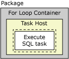

# Integration Services (SSIS) Event Handlers
  At run time, executables (packages and Foreach Loop, For Loop, Sequence, and task host containers) raise events. For example, an OnError event is raised when an error occurs. You can create custom event handlers for these events to extend package functionality and make packages easier to manage at run time. Event handlers can perform tasks such as the following:

-   Clean up temporary data storage when a package or task finishes running.

-   Retrieve system information to assess resource availability before a package runs.

-   Refresh data in a table when a lookup in a reference table fails.

-   Send an e-mail message when an error or a warning occurs or when a task fails.

 If an event has no event handler, the event is raised to the next container up the container hierarchy in a package. If this container has an event handler, the event handler runs in response to the event. If not, the event is raised to the next container up the container hierarchy.

 The following diagram shows a simple package that has a For Loop container that contains one Execute SQL task.

 

 Only the package has an event handler, for its `OnError` event. If an error occurs when the Execute SQL task runs, the `OnError` event handler for the package runs. The following diagram shows the sequence of calls that causes the `OnError` event handler for the package to execute.

 

 Event handlers are members of an event handler collection, and all containers include this collection. If you create the package using [!INCLUDE[ssIS](../includes/ssis-md.md)] Designer, you can see the members of the event handler collections in the **Event Handlers** folders on the **Package Explorer** tab of [!INCLUDE[ssIS](../includes/ssis-md.md)] Designer.

 You can configure the event handler container in the following ways:

-   Specify a name and description for the event handler.

-   Indicate whether the event handler runs, whether the package fails if the event handler fails, and the number of errors that can occur before the event handler fails.

-   Specify an execution result to return instead of the actual execution result that the event handler returns at run time.

-   Specify the transaction option for the event handler.

-   Specify the logging mode that the event handler uses.

## Event Handler Content
 Creating an event handler is similar to building a package; an event handler has tasks and containers, which are sequenced into a control flow, and an event handler can also include data flows. The [!INCLUDE[ssIS](../includes/ssis-md.md)] Designer includes the **Event Handlers** tab for creating custom event handlers. For more information, see [SSIS Package Event Handlers](integration-services-ssis-event-handlers.md).

 You can also create event handlers programmatically. For more information, see [Handling Events Programmatically](building-packages-programmatically/handling-events-programmatically.md).

## Run-Time Events
 The following table lists the event handlers that [!INCLUDE[ssISnoversion](../includes/ssisnoversion-md.md)] provides, and describes the run-time events that cause the event handler to run.

|Event handler|Event|
|-------------------|-----------|
|`OnError`|The event handler for the `OnError` event. This event is raised by an executable when an error occurs.|
|**OnExecStatusChanged**|The event handler for the **OnExecStatusChanged** event. This event is raised by an executable when its execution status changes.|
|**OnInformation**|The event handler for the **OnInformation** event. This event is raised during the validation and execution of an executable to report information. This event conveys information only, no errors or warnings.|
|**OnPostExecute**|The event handler for the **OnPostExecute** event. This event is raised by an executable immediately after it has finished running.|
|**OnPostValidate**|The event handler for the **OnPostValidate** event. This event is raised by an executable when its validation is finished.|
|**OnPreExecute**|The event handler for the **OnPreExecute** event. This event is raised by an executable immediately before it runs.|
|**OnPreValidate**|The event handler for the **OnPreValidate** event. This event is raised by an executable when its validation starts.|
|**OnProgress**|The event handler for the **OnProgress** event. This event is raised by an executable when measurable progress is made by the executable.|
|**OnQueryCancel**|The event handler for the **OnQueryCancel** event. This event is raised by an executable to determine whether it should stop running.|
|**OnTaskFailed**|The event handler for the **OnTaskFailed** event. This event is raised by a task when it fails.|
|**OnVariableValueChanged**|The event handler for the **OnVariableValueChanged** event. This event is raised by an executable when the value of a variable changes. The event is raised by the executable on which the variable is defined. This event is not raised if you set the **RaiseChangeEvent** property for the variable to `False`. For more information, see [Integration Services &#40;SSIS&#41; Variables](integration-services-ssis-variables.md).|
|**OnWarning**|The event handler for the **OnWarning** event. This event is raised by an executable when a warning occurs.|

## Configuration of an Event Handler
 You can set properties in the **Properties** window of [!INCLUDE[ssBIDevStudioFull](../includes/ssbidevstudiofull-md.md)] or programmatically.

 For information about how to set these properties in [!INCLUDE[ssBIDevStudioFull](../includes/ssbidevstudiofull-md.md)], see [Set the Properties of a Task or Container](../../2014/integration-services/set-the-properties-of-a-task-or-container.md).

 For information about programmatically setting these properties, see <xref:Microsoft.SqlServer.Dts.Runtime.DtsEventHandler>.

## Related Tasks
 For information about how to add an event handler to a package, see [Add an Event Handler to a Package](../../2014/integration-services/add-an-event-handler-to-a-package.md).

