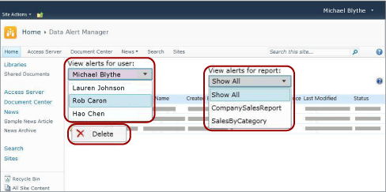

# Manage All Data Alerts on a SharePoint Site in Data Alert Manager
  SharePoint alerting administrators can view a list of the data alerts that were created by any site user and information about the alerts. Alerting administrators can also delete alerts. The following picture shows the features available to alerting administrators in Data Alert Manager.  
  
   
  
### To view a list of alerts created by a site user  
  
1.  Go to the SharePoint site where data alerts definitions are saved.  
  
2.  On the Home page, click **Site Actions**.  
  
3.  Scroll to the bottom of the list and click **Site Settings**.  
  
4.  Under **Reporting Services**, click **Manage Data Alerts**.  
  
5.  Click the down arrow by the **View alerts for user** list and select the user whose alerts you want to view.  
  
6.  Click the down arrow next to the **View alerts for report** list and select a specific alert to view, or click **Show All** to list all alerts created by the selected user.  
  
     A table lists the name, report name, name of the person who created the data alert, the number times the data alert was sent, the last time the data alert definition was modified, and the status of the data alert. If the data alert cannot be generated or sent, the status column contains information about the error and helps you troubleshoot the problem.  
  
### To delete an alert definition  
  
-   Right-click the data alert that you want to delete and click **Delete**.  
  
    > [!NOTE]  
    >  After you delete the alert, no further alert messages are sent. However, if you query the alerting database you might find that the alert definition still exists. The alerting service performs clean up on a schedule and the alert definition is deleted permanently in the next cleanup. The default cleanup interval is 20 minutes. This and other cleanup intervals are configurable. For more information, see [Reporting Services Data Alerts](../ssms/agent/alerts.md).  
  
## See Also  
 [Data Alert Manager for Alerting Administrators](../../2014/reporting-services/data-alert-manager-for-alerting-administrators.md)   
 [Reporting Services Data Alerts](../ssms/agent/alerts.md)  
  
  
