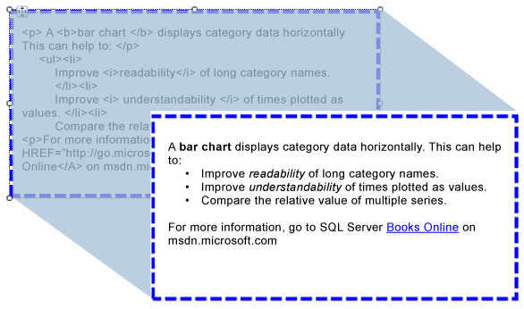

# Importing HTML into a Report (Report Builder and SSRS)
  You can use a text box to insert HTML-formatted text that you have retrieved from a field in your dataset into a report. The text can come from any simple or complex expression that evaluates to correctly formatted HTML. Formatted text can be rendered to all supported output formats, including PDF.  
  
   
  
 This illustration shows text with HTML formatting in report design view, and the same text as it is rendered when the report is run.  
  
> [!NOTE]  
>  When you import text that contains HTML markup, the data must always be parsed by the text box first. Because only a subset of HTML tags is supported, the HTML that is shown in the rendered report may differ from your original HTML.  
  
 To quickly get started, see [Tutorial: Format Text &#40;Report Builder&#41;](../tutorial-format-text-report-builder.md).  
  
> [!NOTE]  
>  [!INCLUDE[ssRBRDDup](../../includes/ssrbrddup-md.md)]  
  
## Supported HTML Tags  
 The following is a complete list of tags that will render as HTML when defined as placeholder text:  
  
-   Header, style and block elements: \<H{n}>, \
, \,\
, \<LI>  
  
 Any other HTML markup tags will be ignored during report processing. If the HTML represented by the expression in the placeholder text is not well formed, the placeholder is rendered as plain text. All HTML tags are case-insensitive.  
  
 If the text in your text box contains only one block of text, any HTML in the placeholder that defines block elements will render correctly. However, if the text box has multiple blocks of text, the HTML tags are ignored and the structure of the text is defined by the blocks of text.  
  
 If more than one tag is defined for text, and [!INCLUDE[ssRSnoversion](../../includes/ssrsnoversion-md.md)] detects a conflict between the HTML and existing report constraints, only the innermost HTML tag will be treated as HTML.  
  
 When using the list handling tags, the font and style of all bullets and number prefixes will be fixed to Arial black.  
  
 For more information, see [Add HTML into a Report &#40;Report Builder and SSRS&#41;](add-html-into-a-report-report-builder-and-ssrs.md).  
  
## Limitations of Cascading Style Sheet Attributes  
 When using cascading style sheet (CSS) attributes, only a basic set of tags are defined. The following is a list of attributes that are supported:  
  
-   text-align, text-indent  
  
-   font-family  
  
-   font-size  
  
    -   Only valid RDL size values, in absolute CSS length units are supported. Supported units are: in, cm, mm, pt, pc.  
  
    -   Relative CSS length units are ignored and not supported. Unsupported units include em, ex, px,%,rem.  
  
-   color  
  
-   padding, padding-bottom, padding-top, padding-right, padding-left  
  
-   font-weight  
  
 Here are some considerations for using CSS:  
  
-   Malformed CSS values are ignored in the same way as malformed HTML.  
  
-   When both attribute and CSS style attributes exist in the same tag, the CSS property has a higher precedence. For example, if your text is **\
**, only the text-align attribute will be applied and the text will be right-aligned.  
  
-   For attributes and CSS styles, if a property is specified more than once, only the last instance of the property is applied. For example, if your text is **\
**, the text will be right-aligned.  
  
## See Also  
 [Rendering to HTML &#40;Report Builder and SSRS&#41;](../report-builder/rendering-to-html-report-builder-and-ssrs.md)  
  
  
