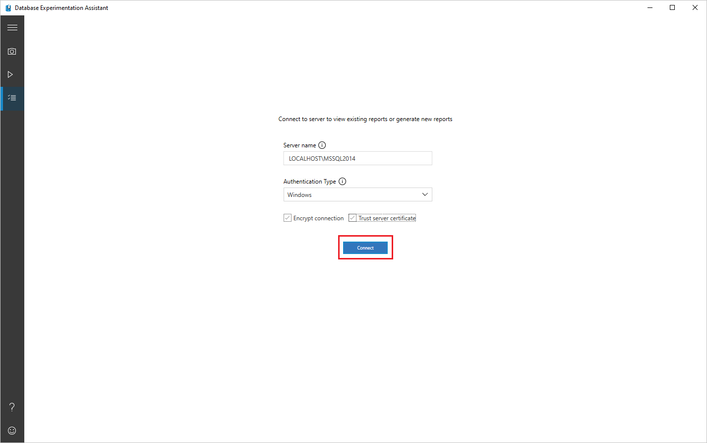
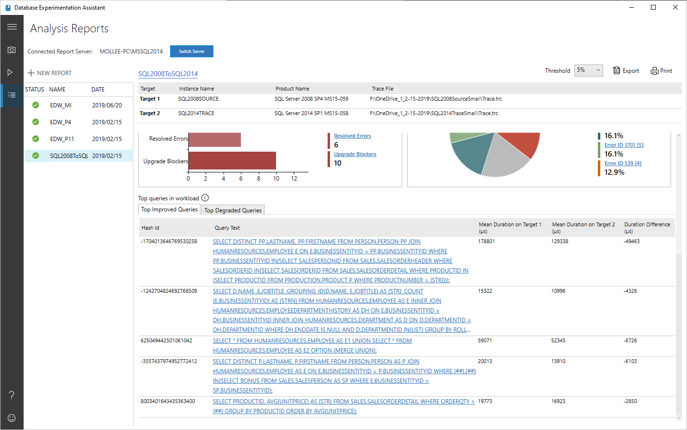

# View analysis reports in Database Experimentation Assistant

After you use Database Experimentation Assistant (DEA) to [create an analysis report](database-experimentation-assistant-create-report.md), you can review the report for performance insights based on the A/B test you performed.

## Open an existing analysis report

1. In DEA, select the list icon, specify the server name and authentication type, select or deselect the **Encrypt connection** and **Trust server certificate** check boxes as appropriate for your scenario, and then select **Connect**.

   

2. On the **Analysis Reports** screen, on the left-hand side, select the entry for the report you want to view.

   

## View and understand the analysis report

This section walks you through the analysis report.

On the first page of your report, information about the version and build information for the target servers on which the experiment was run appears. Threshold allows you to adjust the sensitivity or tolerance of your A/B Test analysis. By default, threshold is set at 5%; any improvement in performance that is >= 5% is categorized as ‘Improved’.  The dropdown allows you to evaluate the report with different performance thresholds.

You can export the data in the report to a CSV file be selecting **Export** button.  On any page of the analysis report, you can select **Print** to print what is visible on the screen at that moment.

### Query distribution

- Select different slices of the pie charts to show only the queries that belong to that category.

   

  - **Degraded**: Queries that performed worse on Target 2 than on Target 1.
  - **Errors**: Queries that showed errors at least one time on at least one of the targets.
  - **Improved**: Queries that performed better on Target 2 than on Target 1.
  - **Cannot Evaluate**: Queries that had a sample size too small for statistical analysis. For A/B testing analysis, DEA requires the same queries to have at least 15 executions on each target.
  - **Same**: Queries that have no statistical difference between Target 1 and Target 2.

  Error queries, if any, are shown in separate charts; a bar chart classifying errors by type and a pie chart classifying errors by Error ID.

   

  There are four possible types of errors:

  - **Existing Errors**: Errors that exist on both Target 1 and Target 2.
  - **New Errors**: Errors that are new on Target 2.
  - **Resolved Errors**: Errors that exist on Target 1 but are resolved on Target 2.
  - **Upgrade Blockers**: Errors that block upgrade to target server.

  Clicking on any bar or pie section in the charts drills down into the category and shows performance metrics, even for the **Cannot Evaluate** category.

  In addition, the dashboard shows the top five improved and degraded queries to provide a quick performance overview.

### Individual query drill-down

You can select query template links for more detailed information about specific queries.

- Select a specific query to open the related comparison summary.

   

   You can find summary statistics for that query, such as the number of executions, mean duration, mean CPU, mean reads/writes, and error count.  If the query is an error query, the **Error Information** tab shows you more detail about the error.  On the **Query Plan Information** tab, you can find information about the query plans used for the query on Target 1 and Target 2.

   > [!NOTE]
   > If you are analyzing extended event (.XEL) files, query plan information isn't collected to limit the memory pressure on the user’s computer.

## See also

- To learn how to generate an analysis report at a command prompt, see [Run at command prompt](database-experimentation-assistant-run-command-prompt.md).
