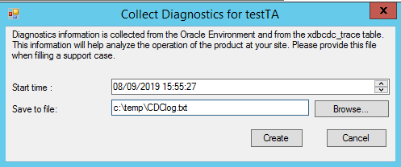
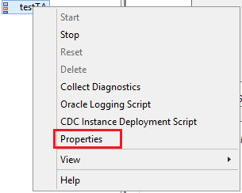
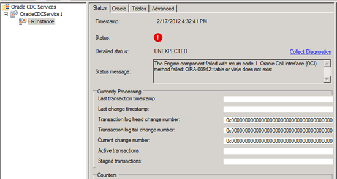
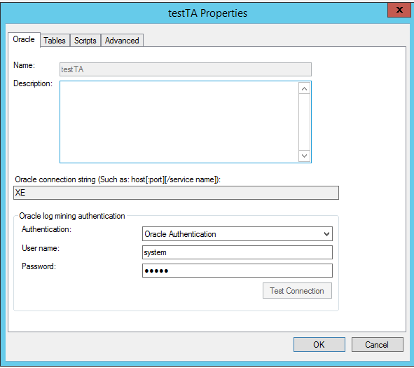

# Known errors and resolutions with change data capture for Oracle by Attunity
[!INCLUDE[tsql-appliesto-ss2008-asdbmi-xxxx-xxx-md](../../includes/tsql-appliesto-ss2012-asdbmi-xxxx-xxx-md.md)]

This topic lists the top issues and known resolutions when viewing a change data capture (CDC) instance in the Oracle CDC Designer configuration tool. This tool is part of the Change Data Capture for Oracle by Attunity that is included starting with SQL Server 2012. 

## Bug fixes
Before spending too much time troubleshooting, it is important to use the latest builds of CDC for Oracle by Attunity to avoid known issues such as these:

### SQL Server 2017

**Version 5.0.0.111** contains these fixes:
- Bug fix - Oracle CDC Designer fails with "Incorrect syntax near the keyword 'KEY'" error when adding an Oracle table. 
- Improvement - Improved support for RAC, this includes better handling when an RAC node is restarted. 
- Bug fix - The CDC is not working with Oracle 10.2 due to requesting NEXT_CHANGE# from the v$log. 


**Version 5.0.0.93** contains these fixes: 
- Microsoft CDC for Oracle by Attunity Designer fails with "Incorrect syntax near the word 'KEY'" error when adding an Oracle table. 

 
### SQL Server 2016

**Version 4.0.107** contains these fixes:
- Bug Fixes – Oracle CDC Designer fails with "Incorrect syntax near the keyword 'KEY'" error when adding an Oracle Table.
- Improvement – Improved support for RAC, this includes better handling when a RAC node is restarted.
- Bug Fixes – The CDC is not working with Oracle 10.2 due to requesting NEXT_CHANGE# from the v$log.

**Version 4.0.0.95** contains these fixes: 
- Bug Fixes – Oracle CDC Designer fails with "Incorrect syntax near the keyword 'KEY'" error when adding an Oracle Table.

**Version 4.0.0.88** contains these fixes:
-  Properties added in the Advanced options of the Attunity CDC instance are removed when a table is added or removed from CDC. 
- Attunity CDC stops working after applying SQL fix that adds __$command_id column

### SQL Server 2014 

**Version 2.0.0.114** contains these fixes:
- Bug Fixes – Oracle CDC Designer fails with "Incorrect syntax near the keyword 'KEY'" error when adding an Oracle Table.
- Improvement – Improved support for RAC, this includes better handling when a RAC node is restarted.
- Bug Fixes – The CDC is not working with Oracle 10.2 due to requesting NEXT_CHANGE# from the v$log.

**Version 2.0.0.92** contains these fixes: 
- Properties added in the Advanced options of the Attunity CDC instance are removed when a table is added or removed from CDC. Attunity CDC stops working after applying SQL fix that adds __$command_id column
- The metadata validation for Oracle table cdc.table_name failed. Column column_name index is out of range.  And this issue: Oracle CDC service shows aborted status when you use CDC for Oracle by Attunity
    - Fixed in _Cumulative Update 1 for SQL Server 2014 RTM_ as described in KB [2894025](https://support.microsoft.com/kb/2894025).
- Some changes are missed and are not replicated to the SQL Server database. This issue occurs when a table contains more than one character large binary object (CLOB) and one of the CLOBs has a large value. 
    - Fixed in _Cumulative Update 1 for SQL Server 2014 SP1_ and _Cumulative Update 8 for SQL Server 2014 RTM_ as described in KB [3029096](https://support.microsoft.com/kb/3029096). 
- Change Data Capture for Oracle by Attunity stops working when Oracle tables have column with Long data type.
    - Fixed in _Cumulative Update 5 for SQL Server 2014 SP1_ and _Cumulative Update 12 for SQL 2014 RTM_ as described in KB [3145983](https://support.microsoft.com/kb/3145983).

### SQL Server 2012

**Version 1.1.0.102** contains these fixes: 
 
- Properties added in the Advanced options of the Attunity CDC instance are removed when a table is added or removed from CDC. Attunity CDC stops working after applying SQL fix that adds __$command_id column
- CDC for Oracle instance hangs when you start it, and does not capture changes. Oracle server memory may increase until it runs out of memory or crash.
- [2672759](https://support.microsoft.com/kb/2672759): Error message when you use the Microsoft Change Data Capture Service for Oracle by Attunity: "ORA-00600: internal error code". Add the SOURCE level tracing and confirm if you get the same ORA-00600 error. Fixed by an Oracle patch download.
- Multiple Partitions
    - When you use more than 10 partitions on an Oracle table, the CDC instance cannot capture all the changes for the table. When the Oracle table is defined with more than 10 partitions, the changes are only captured from the last 10 partitions. Fixed in the _Service Pack 1 release for SQL Server 2012_. See [SP1 Feature Pack download page](https://www.microsoft.com/download/details.aspx?id=35580). 
- Changes are lost
    - The capturing of events can go into an infinite loop and stop capturing new data changes (related to Oracle bug 5623813). When on Oracle RAC environment is performing a stop or resume  of the CDC instance, changes can be skipped/lost. This means the SQL Server change data capture will be missing important rows, and thus there is data loss in the data warehouse or subscribing system. Fixed in the _Service Pack 1 release for SQL Server 2012_. See [SP1 Feature Pack download page](https://www.microsoft.com/download/details.aspx?id=35580)
- Double widths on columns in SQL
    - When creating a CDC for Oracle instance, in the scripts to run against SQL Server, the length of a variable width data type column is doubled in SQL Server tables that are created in the script. For example, if you try to track changes on a VARCHAR2(10) column in an Oracle table, then the corresponding column in the SQL Server table is NVARCHAR(20) in the deployment script. Fix in either _Cumulative Update 2 for SQL Server 2012 SP1_ or _Cumulative update 5 for SQL Server 2012_ as described in KB [2769673](https://support.microsoft.com/kb/2769673). 
- DDL Data is truncated
    - When you run a Data Definition Language (DDL) statement that is more than 4,000 bytes against an Oracle database that contains non-Latin characters, CDC for Oracle by Attunity fails. Additionally, you see the error message `ORA-01406: fetched column value was truncated.`. Fixed in _Cumulative Update 4 for SQL Server 2012 SP1_ as described in KB [2839806](https://support.microsoft.com/kb/2839806). 
- Changes are lost in last two columns
    - Fixed in _Cumulative update 6 for SQL Server 2012 SP1_ as described in KB [2874879](https://support.microsoft.com/kb/2874879). 
- SQL Transaction log grows when you use CDC for Oracle
     - When Change Data Capture for Oracle instances are configured, the SQL database that receives the changed data will have mirrored tables, with   transactions marked for replication. This behavior occurs because CDC for Oracle relies on underlying system stored procedures that resemble those that are used in CDC for SQL Server. However, because there is no SQL CDC replication involved when CDC for Oracle is used alone, there is no log reader to clear the transactions that are marked for replication. Because the transaction does not have to be replicated in SQL Server, it's safe to manually mark the transaction as distributed by using the workaround that's described later in this article. More information can be found in KB [2871474](https://support.microsoft.com/kb/2871474). 
- Error `ORACDC000T: Error encountered at position to change event - SCN not found - EOF simulated`. Fixed in _Cumulative Update 7 for SQL Server 2012 SP1_ as described in KB [2883524](https://support.microsoft.com/kb/2883524). 
- The metadata validation for Oracle table cdc.table_name failed. Column column_name index is out of range. Fixed in _Cumulative Update 7 for SQL Server 2012 SP1_ as described in KB [2883524](https://support.microsoft.com/kb/2883524).
- Oracle CDC service shows aborted status when you use CDC for Oracle by Attunity in SQL Server 2012. Fixed in _Cumulative Update 8 for SQL Server 2012 SP1_ as described in KB [2923839](https://support.microsoft.com/kb/2923839).  
- Some changes are missed and are not replicated to the SQL Server databases. This issue occurs when a table contains more than one character large binary object (CLOB) and one of the CLOBs has a large value. Fixed in _Cumulative Update 8 for SQL Server 2012 SP1_ as described in KB [2923839](https://support.microsoft.com/kb/2923839).   
- Change Data Capture for Oracle by Attunity stops working when Oracle tables have column with Long data type. Fixed in _Cumulative Update 2 for SQL Server 2012 SP3_ and _Cumulative Update 11 for SQL 2012 SP2_  as described in KB [3145983](https://support.microsoft.com/kb/3145983). 

## Collect detailed logs 

This section explains how to collect errors and events from the CDC instance. 

### Management console

You can see errors in the **Status** messages filed within the Oracle Change Data Capture Designer management console when a CDC instance is highlighted in the left pane. 

### Query trace table

You can query the trace table in the CDC database within SQL Server to see logged errors. 

### Save output from basic logging 

To capture diagnostics, select **Collect Diagnostics** on the status tab in the Oracle Change Data Capture management console. 


Choose a start time and select a location for the log file. Then select **Create** to start the diagnostics collection. 



### Detailed errors

You can increase the level of tracing collected by the instance and repeat the scenario to gather more detailed logging. To do so, select **Properties** under **Actions** and then add a new property in the **Advanced Settings** grid on the **Advanced** tab. Set the name of the property to `trace` and then set the value to `SOURCE`. 



Reproduce the error and then select the **Collect diagnostics** option to gather logs. 


## ORA-00942 Table of view does not exist 

This is a common error displayed in the **Status** message field of the CDC Instance. The instance retries numerous times, so the status icon will change to green momentarily, but then it will fail with the red exclamation and UNEXPECTED status. 



```
"ERROR","computername","ERROR","UNEXPECTED",
"ORACDC508E:Oracle method OCIStmtExecute failed with error: ORA-00942: table or view does not exist ","source","",""

"ERROR","computername","RUNNING","IDLE",
"ORACDC518E:Failed to verify archive log mode.","source","",""

"ERROR","computername","ERROR","UNEXPECTED",
"ORACDC517E:Oracle Call Interface (OCI) method failed: ORA-00942: table or view does not exist .","source","",""

"ERROR","computername","ERROR","UNEXPECTED",
"ORACDC414E:The Engine component failed with return code 1.","engine","",""
```

This happens when the Oracle account connecting from the CDC instance to the Oracle server does not have permission to see system log views. 

### Resolution

To resolve this error, either grant the currently configured user appropriate permissions within the Oracle database system, or change which account is being used to connect to the Oracle server from the CDC instance. 

The list of all the necessarily permissions is detailed in the help file included in the installation program files folder `C:\Program Files\Change Data Capture for Oracle by Attunity\Attunity.SqlServer.XdbCdcDesigner.chm`.  See the page titled "Connect to an Oracle Source Database" within the .chm file for the complete list.

You can set the user account by selecting the CDCInstance from the left pane and selecting the Properties button in the Actions right-most pane within the **CDC Designer** window. You can change the Oracle log mining authentication account from the properties dialogue page.




  
## See also  
 [Track Data Changes &#40;SQL Server&#41;](../../relational-databases/track-changes/track-data-changes-sql-server.md)   
 [About Change Data Capture &#40;SQL Server&#41;](../../relational-databases/track-changes/about-change-data-capture-sql-server.md)   
 [Work with Change Data &#40;SQL Server&#41;](../../relational-databases/track-changes/work-with-change-data-sql-server.md)   
 [Administer and Monitor Change Data Capture &#40;SQL Server&#41;](../../relational-databases/track-changes/administer-and-monitor-change-data-capture-sql-server.md)  
  
  
