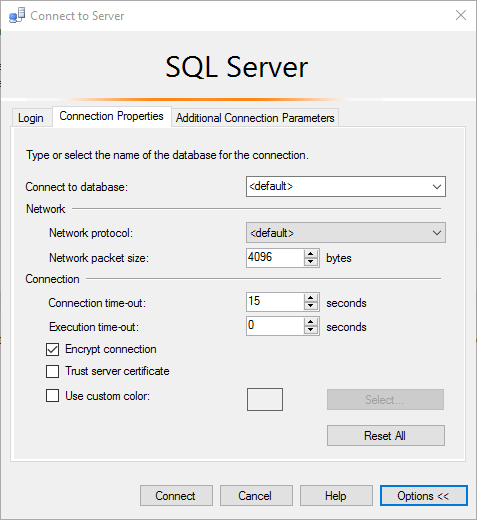

# Encrypting Connections to SQL Server on Linux

[!INCLUDE[appliesto-ss-xxxx-xxxx-xxx-md-linuxonly](../includes/appliesto-ss-xxxx-xxxx-xxx-md-linuxonly.md)]

[!INCLUDE[ssNoVersion](../includes/ssnoversion-md.md)] on Linux can use Transport Layer Security (TLS) to encrypt data that is transmitted across a network between a client application and an instance of [!INCLUDE[ssNoVersion](../includes/ssnoversion-md.md)]. [!INCLUDE[ssNoVersion](../includes/ssnoversion-md.md)] supports the same TLS protocols on both Windows and Linux: TLS 1.2, 1.1, and 1.0. However, the steps to configure TLS are specific to the operating system on which [!INCLUDE[ssNoVersion](../includes/ssnoversion-md.md)] is running.  

## Requirements for Certificates 
Before getting started, you need to make sure your certificates follow these requirements:
- The current system time must be after the Valid from property of the certificate and before the Valid to property of the certificate.
- The certificate must be meant for server authentication. This requires the Enhanced Key Usage property of the certificate to specify Server Authentication (1.3.6.1.5.5.7.3.1).
- The certificate must be created by using the KeySpec option of AT_KEYEXCHANGE. Usually, the certificate's key usage property (KEY_USAGE) also includes key encipherment (CERT_KEY_ENCIPHERMENT_KEY_USAGE).
- The Subject property of the certificate must indicate that the common name (CN) is the same as the host name or fully qualified domain name (FQDN) of the server computer. Note: Wild Card Certificates are supported.

## Configuring the OpenSSL Libraries for Use (Optional)
You can create symbolic links in the `/opt/mssql/lib/` directory that reference which `libcrypto.so` and `libssl.so` libraries should be used for encryption. This is useful if you want to force SQL Server to use a specific version of OpenSSL other than the default provided by the system. If these symbolic links are not present, SQL Server will load the default configured OpenSSL libraries on the system.

These symbolic links should be named `libcrypto.so` and `libssl.so` and placed in the `/opt/mssql/lib/` directory.

## Overview
TLS is used to encrypt connections from a client application to [!INCLUDE[ssNoVersion](../includes/ssnoversion-md.md)]. When configured correctly, TLS provides both privacy and data integrity for communications between the client and the server.  TLS connections can either be client initiated or server initiated. 

## Client Initiated Encryption 
- **Generate certificate** (/CN should match your SQL Server host fully qualified domain name)

> [!NOTE]
> For this example we use a Self-Signed Certificate, this should not be used for production scenarios. You should use CA certificates. 

        openssl req -x509 -nodes -newkey rsa:2048 -subj '/CN=mssql.contoso.com' -keyout mssql.key -out mssql.pem -days 365 
        sudo chown mssql:mssql mssql.pem mssql.key 
        sudo chmod 600 mssql.pem mssql.key   
        sudo mv mssql.pem /etc/ssl/certs/ 
        sudo mv mssql.key /etc/ssl/private/ 

- **Configure SQL Server**

        systemctl stop mssql-server 
        cat /var/opt/mssql/mssql.conf 
        sudo /opt/mssql/bin/mssql-conf set network.tlscert /etc/ssl/certs/mssql.pem 
        sudo /opt/mssql/bin/mssql-conf set network.tlskey /etc/ssl/private/mssql.key 
        sudo /opt/mssql/bin/mssql-conf set network.tlsprotocols 1.2 
        sudo /opt/mssql/bin/mssql-conf set network.forceencryption 0 

- **Register the certificate on your client machine (Windows, Linux, or macOS)**

    -   If you are using CA signed certificate, you have to copy the Certificate Authority (CA) certificate instead of the user certificate to the client machine. 
    -   If you are using the self-signed certificate, just copy the .pem file to the following folders respective to distribution and execute the commands to enable them 
        - **Ubuntu**: Copy cert to ```/usr/share/ca-certificates/```  rename extension to .crt  use dpkg-reconfigure ca-certificates to enable it as system CA certificate. 
        - **RHEL**: Copy cert to ```/etc/pki/ca-trust/source/anchors/``` use ```update-ca-trust``` to enable it as system CA certificate.
        - **SUSE**: Copy cert to ```/usr/share/pki/trust/anchors/``` use ```update-ca-certificates``` to enable it as system CA certificate.
        - **Windows**:  Import the .pem file as a certificate under current user -> trusted root certification authorities -> certificates
        - **macOS**: 
           - Copy the cert to ```/usr/local/etc/openssl/certs```
           - Run the following command to get the hash value: ```/usr/local/Cellar/openssl/1.0.2l/openssl x509 -hash -in mssql.pem -noout```
           - Rename the cert to value. For example: ```mv mssql.pem dc2dd900.0```. Make sure dc2dd900.0 is in ```/usr/local/etc/openssl/certs```
    
-	**Example connection strings** 

    - **[!INCLUDE[ssmanstudiofull-md](../includes/ssmanstudiofull-md.md)]**   
    
  
    - **SQLCMD** 

            sqlcmd  -S <sqlhostname> -N -U sa -P '<YourPassword>' 
    - **ADO.NET** 

            "Encrypt=True; TrustServerCertificate=False;" 
    - **ODBC** 

            "Encrypt=Yes; TrustServerCertificate=no;" 
    - **JDBC** 
    
            "encrypt=true; trustServerCertificate=false;" 

## Server Initiated Encryption 

- **Generate certificate** (/CN should match your SQL Server host fully-qualified domain name)
        
        openssl req -x509 -nodes -newkey rsa:2048 -subj '/CN=mssql.contoso.com' -keyout mssql.key -out mssql.pem -days 365 
        sudo chown mssql:mssql mssql.pem mssql.key 
        sudo chmod 600 mssql.pem mssql.key   
        sudo mv mssql.pem /etc/ssl/certs/ 
        sudo mv mssql.key /etc/ssl/private/ 

- **Configure SQL Server**

        systemctl stop mssql-server 
        cat /var/opt/mssql/mssql.conf 
        sudo /opt/mssql/bin/mssql-conf set network.tlscert /etc/ssl/certs/mssql.pem 
        sudo /opt/mssql/bin/mssql-conf set network.tlskey /etc/ssl/private/mssql.key 
        sudo /opt/mssql/bin/mssql-conf set network.tlsprotocols 1.2 
        sudo /opt/mssql/bin/mssql-conf set network.forceencryption 1 
        
-	**Example connection strings** 

    - **SQLCMD**

            sqlcmd  -S <sqlhostname> -U sa -P '<YourPassword>' 
    - **ADO.NET** 

            "Encrypt=False; TrustServerCertificate=False;" 
    - **ODBC** 

            "Encrypt=no; TrustServerCertificate=no;"  
    - **JDBC** 
    
            "encrypt=false; trustServerCertificate=false;" 
            
> [!NOTE]
> Set **TrustServerCertificate** to True if the client cannot connect to CA to validate the authenticity of the cert

## Common connection errors  

|Error message |Fix |
|--- |--- |
|The certificate chain was issued by an authority that is not trusted.  |This error occurs when clients are unable to verify the signature on the certificate presented by SQL Server during the TLS handshake. Make sure the client trusts either the [!INCLUDE[ssNoVersion](../includes/ssnoversion-md.md)] certificate directly, or the CA which signed the SQL Server certificate. |
|The target principal name is incorrect.  |Make sure that Common Name field on SQL Server's certificate matches the server name specified in the client's connection string. |  
|An existing connection was forcibly closed by the remote host. |This error can occur when the client doesn't support the TLS protocol version required by SQL Server. For example, if [!INCLUDE[ssNoVersion](../includes/ssnoversion-md.md)] is configured to require TLS 1.2, make sure your clients also support the TLS 1.2 protocol. |
| | |   
