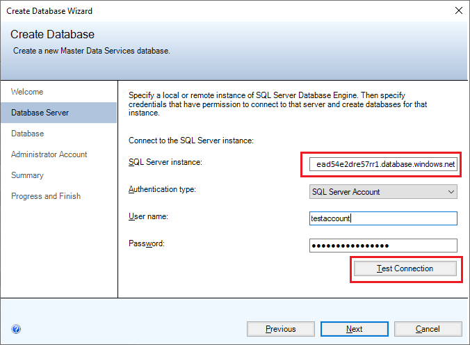
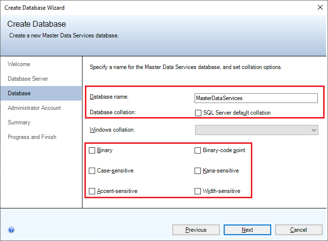
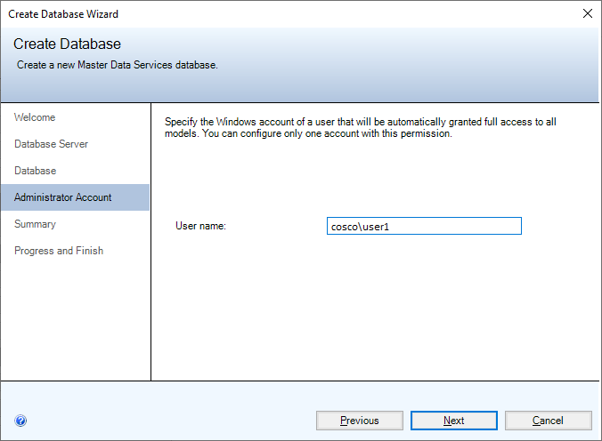
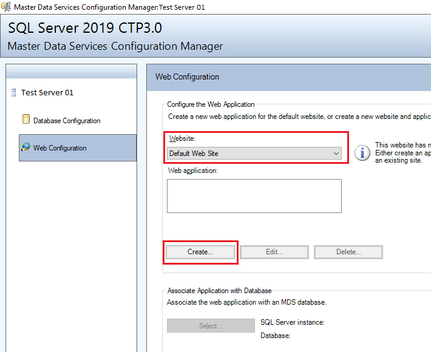

# Host an MDS database on a managed instance

[!INCLUDE[appliesto-ss-xxxx-xxxx-xxx-md-winonly](../includes/appliesto-ss-xxxx-xxxx-xxx-md-winonly.md)]

  This article covers how to configure a Master Data Services (MDS) database on a managed instance.
  
## Preparation

To prepare, you need to create and configure an Azure SQL Database managed instance and configure your web application machine.

### Create and configure the database

1. Create an Azure SQL Database managed instance with a virtual network. See [Quickstart: Create an Azure SQL Database managed instance](https://docs.microsoft.com/azure/sql-database/sql-database-managed-instance-get-started) for details.

1. Configure a Point-to-Site connection. See [Configure a Point-to-Site connection to a VNet using native Azure certificate authentication: Azure portal](https://docs.microsoft.com/azure/vpn-gateway/vpn-gateway-howto-point-to-site-resource-manager-portal) for instructions.

1. Configure Azure Active Directory authentication with SQL Database managed instance. See [Configure and manage Azure Active Directory authentication with SQL](https://docs.microsoft.com/azure/sql-database/sql-database-aad-authentication-configure) for details.

### Configure web application machine

1. Install a Point-to-Site connection certificate and VPN to ensure that the machine can access the SQL Database managed instance. Refer to [Configure a Point-to-Site connection to a VNet using native Azure certificate authentication: Azure portal](https://docs.microsoft.com/azure/vpn-gateway/vpn-gateway-howto-point-to-site-resource-manager-portal) for instructions.

1. Install the following Roles and Features:
   - Roles:
     - Internet Information Services
     - Web Management Tools
     - IIS Management Console
     - World Wide Web Services
     - Application Development
     - .NET Extensibility 3.5
     - .NET Extensibility 4.5
     - ASP.NET 3.5
     - ASP.NET 4.5
     - ISAPI Extensions
     - ISAPI Filters
     - Common HTTP Features
     - Default Document
     - Directory Browsing
     - HTTP Errors
     - Static Content
     - Health and Diagnostics
     - HTTP Logging
     - Request Monitor
     - Performance
     - Static Content Compression
     - Security
     - Request Filtering
     - Windows Authentication
       > [!NOTE]
       > Don't install WebDAV Publishing

   - Features:
     - .NET Framework 3.5 (includes .NET 2.0 and 3.0)
     - .NET Framework 4.5 Advanced Services
     - ASP.NET 4.5
     - WCF Services
     - HTTP Activation (required)
     - TCP Port Sharing
     - Windows Process Activation Service
     - Process Model
     - .NET Environment
     - Configuration APIs
     - Dynamic Content Compression

## Install and configure an MDS web application

Next, you install and configure [!INCLUDE[ssMDSshort_md](../includes/ssmdsshort-md.md)].

### Install SQL Server 2019

Use the SQL Server setup installation wizard or a command prompt to install [!INCLUDE[ssMDSshort_md](../includes/ssmdsshort-md.md)].

1. Open `Setup.exe`, and follow the steps in the installation wizard.

2. Select [!INCLUDE[ssMDSshort_md](../includes/ssmdsshort-md.md)] on the **Feature Selection** page under **Shared Features**.
This action installs:
   - [!INCLUDE[ssMDScfgmgr](../includes/ssmdscfgmgr-md.md)]
   - Assemblies
   - A Windows PowerShell snap-in
   - Folders and files for web applications and services.

     

### Set up the database and website

1. Connect the Azure Virtual Network to ensure that you can connect to the managed instance.

   

1. Open the [!INCLUDE[ssMDScfgmgr](../includes/ssmdscfgmgr-md.md)] and then select **Database Configuration** in the left pane.

1. Select **Create Database** to open the **Create Database Wizard**. Select **Next**.

1. On the **Database Server** page, complete the **SQL Server instance** field, and then choose the **Authentication type**. Select **Test Connection** to confirm that you can use your credentials to connect to the database via the chosen authentication type. Select **Next**.

   > [!NOTE]
   > - A SQL Server instance looks like `xxxxxxx.xxxxxxx.database.windows.net`.
   > - For a managed instance, choose from **"SQL Server Account"** and **"Current User – Active Directory Integrated"** authentication types.
   > - If you select **Current User – Active Directory Integrated** as the authentication type, the **User name** field is read-only and displays the currently signed-on Windows user account. If you are running SQL Server 2019 [!INCLUDE[ssMDSshort_md](../includes/ssmdsshort-md.md)] on an Azure Virtual Machine (VM), the **User name** field displays the VM name and the user name for the local administrator account on the VM.

   Your authentication must contain the **"sysadmin"** rule for managed instances.

     

1. Type a name in the **Database name** field. Optionally, to select a Windows collation, clear the **SQL Server default collation** check box and select one or more of the available options. For example, **Case-sensitive**. Select **Next**.

   

1. In the **User name** field, specify the Windows account of the default super user for [!INCLUDE[ssMDSshort_md](../includes/ssmdsshort-md.md)]. A super user has access to all functional areas and can add, delete, and update all models.

   

1. Select **Next** to view a summary of the settings for the [!INCLUDE[ssMDSshort_md](../includes/ssmdsshort-md.md)] database. Select  **Next** again to create the database. You'll see the **Progress and Finish** page.

1. After the database is created and configured, select **Finish**.

   For more information about the settings in the **Create Database Wizard**, see [Create Database Wizard &#40;[!INCLUDE[ssMDSshort_md](../includes/ssmdsshort-md.md)] Configuration Manager&#41;](../master-data-services/create-database-wizard-master-data-services-configuration-manager.md).

1. On the **Database Configuration** page in the [!INCLUDE[ssMDScfgmgr](../includes/ssmdscfgmgr-md.md)], choose **Select Database**.

1. Select **Connect**, choose the [!INCLUDE[ssMDSshort_md](../includes/ssmdsshort-md.md)] database and then select **OK**.

   

1. In [!INCLUDE[ssMDScfgmgr](../includes/ssmdscfgmgr-md.md)], select **Web Configuration** in the left pane.

1. In the **Website** list box, choose **Default Web Site**, and then select **Create** to create a web application.

   

   > [!NOTE]
   > If you select **Default Web Site**, you'll need to separately create a web application. If you choose **Create new website** in the list box, the application is automatically created.

1. In the **Application Pool** section, enter a different user name, enter the password, and then select **OK**.

   

   > [!NOTE]
   > Make sure that the user can access the database with the Active Directory Integrated authentication that you recently created. Alternatively, you can change the connection in `web.config` later.

   For more information about the **Create Web Application** dialog box, see [Create Web Application Dialog Box &#40;[!INCLUDE[ssMDSshort_md](../includes/ssmdsshort-md.md)] Configuration Manager&#41;](../master-data-services/create-web-application-dialog-box-master-data-services-configuration-manager.md).

1. On the **Web Configuration** pane in the **Web application** window, select the application you've created, and then choose **Select** in the **Associate Application with Database** section.

1. Select **Connect** and choose the [!INCLUDE[ssMDSshort_md](../includes/ssmdsshort-md.md)] database that you want to associate with the web application. Select **OK**.

   You've finished setting up the website. The **Web Configuration** page now displays the website you selected, web application you created, and the [!INCLUDE[ssMDSshort_md](../includes/ssmdsshort-md.md)] database associated with the application.

   

1. Select **Apply**. You'll see the **Configuration Complete** message. Select **OK** in the message box to launch the web application. The website address is `http://server name/web application/`.

## Configure authentication

To connect the managed instance database to the web application, you need to change the other authentication type.

Find the `web.config` file under `C:\Program Files\Microsoft SQL Server\150\Master Data Services\WebApplication`. Modify the connectionString to change the other authentication type to connect to the managed instance database.

The default authentication type is `Active Directory Integrated` as shown in the following sample connection string:

   ```xml
   <add name="MDS1" connectionString="Data Source=*****.*****.database.windows.net;Initial Catalog=MasterDataServices;Integrated Security=False;Connect Timeout=60;Authentication=&quot;Active Directory Integrated&quot;" />
   ```

MDS also supports Active Directory password authentication and SQL Server authentication, as shown in the following sample connection strings:

- Active Directory password authentication

   ```xml
   <add name="MDS1" connectionString="Data Source=*****.*****.database.windows.net;Initial Catalog=MasterDataServices;Integrated Security=False;Connect Timeout=60;Authentication=&quot;Active Directory Password&quot; ; UID=bob@contoso.onmicrosoft.com; PWD=MyPassWord!" />
   ```

- SQL Server authentication

   ```xml
   <add name="MDS1" connectionString="Data Source=*****.*****.database.windows.net;Initial Catalog=MasterDataServices;Integrated Security=False;Connect Timeout=60;User ID=UserName;Password=MyPassword!;" />
   ```

## Upgrade [!INCLUDE[ssMDSshort_md](../includes/ssmdsshort-md.md)] and SQL Database version

### Upgrade [!INCLUDE[ssMDSshort_md](../includes/ssmdsshort-md.md)]

Install the **SQL Server 2019 Cumulative Update**. [!INCLUDE[ssMDSshort_md](../includes/ssmdsshort-md.md)] will be updated automatically.

### Upgrade SQL Server

You might get the error: `The client version is incompatible with the database version` after installing **SQL Server 2019 Cumulative Update**.


To fix this issue, you need upgrade the database version:

1. Open the [!INCLUDE[ssMDScfgmgr](../includes/ssmdscfgmgr-md.md)], and then select  **Database Configuration** in the left pane.

1. On the **Database Configuration** page in the [!INCLUDE[ssMDScfgmgr](../includes/ssmdscfgmgr-md.md)], choose **Select Database**.

1. Choose the [!INCLUDE[ssMDSshort_md](../includes/ssmdsshort-md.md)] database that you associated with the web application. Select **Connect**, and then select **OK**.

   

1. Select **Upgrade Database…** .

   

1. In the Upgrade Database Wizard, select **Next** on the **Welcome** page and on the  **Upgrade Review** page.

   

1. Select **Finish** after all tasks are complete.

## See also

- [Master Data Services Database](../master-data-services/master-data-services-database.md)
- [Master Data Manager Web Application](../master-data-services/master-data-manager-web-application.md)
- [Database Configuration Page &#40;Master Data Services Configuration Manager&#41;](../master-data-services/database-configuration-page-master-data-services-configuration-manager.md)
- [What's New in Master Data Services &#40;MDS&#41;](../master-data-services/what-s-new-in-master-data-services-mds.md)
