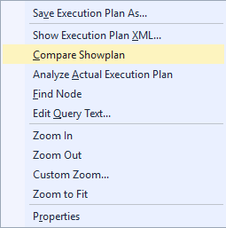
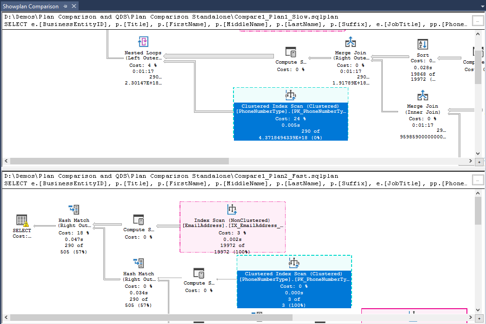
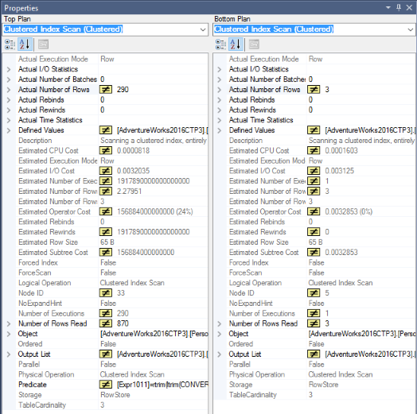
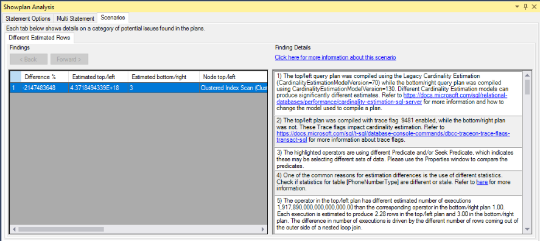
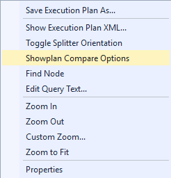
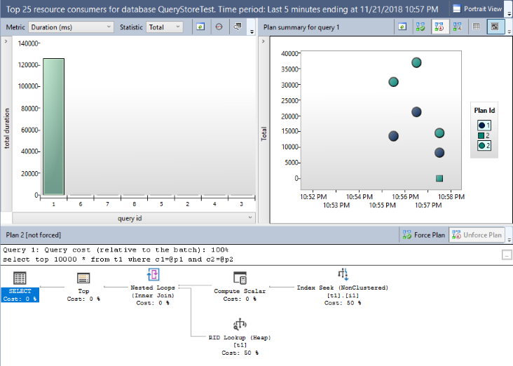

# Compare execution plans
[!INCLUDE[appliesto-ss-xxxx-xxxx-xxx-md](../../includes/appliesto-ss-xxxx-xxxx-xxx-md.md)]
This topic describes how to compare similarities and differences between actual graphical execution plans by using [!INCLUDE[ssManStudioFull](../../includes/ssmanstudiofull-md.md)] Plan Comparison feature. This feature is available starting with [!INCLUDE[ssManStudioFull](../../includes/ssmanstudiofull-md.md)] v16.
  
> [!NOTE]
> Actual execution plans are generated after the [!INCLUDE[tsql](../../includes/tsql-md.md)] queries or batches execute. Because of this, an actual execution plan contains runtime information, such as actual number of rows, resource usage metrics and runtime warnings (if any). For more information, see [Display an Actual Execution Plan](../../relational-databases/performance/display-an-actual-execution-plan.md).
  
The ability to compare plans is something that database professionals may have to do for troubleshooting reasons:
-   Find why a query or batch suddenly slowed down.
-   Understand the impact of a query rewrite.
-   Observe how a specific performance-enhancing change introduced to the schema design (like a new index) has effectively changed the execution plan.  
 
The **Plan Comparison** menu option allows side-by-side comparison of two different execution plans, for easier identification of similarities and changes that explain the different behaviors for all the reasons stated above. This option can compare between:
- Two previously saved execution plan files (*.sqlplan* extension).
- One active execution plan and one previously saved query execution plan.
- Two selected query plans in [Query Store](../../relational-databases/performance/monitoring-performance-by-using-the-query-store.md).

> [!TIP]
> Plan Comparison works with any *.sqlplan* files, even from older versions of [!INCLUDE[ssNoVersion](../../includes/ssnoversion-md.md)]. Also, this option enables an offline compare, so there's no need to be connected to a [!INCLUDE[ssNoVersion](../../includes/ssnoversion-md.md)] instance. 

When two execution plans are compared, regions of the plan that **do essentially the same** are highlighted in the same color and pattern. Clicking on a colored region in one plan will center the other plan on the matching node in that plan. You can still compare unmatched operators and nodes of the execution plans, but in that case you must manually select the operators to compare.

> [!IMPORTANT]
> Only nodes considered to change the shape of the plan are used to check for similarities. Therefore, there may be a node which is not colored in the middle of two nodes that are in the same subsection of the plan. The lack of color in this case implies that the nodes were not considered when checking if the sections are equal.
  
## To compare execution plans
  
1.  Open a previously saved query execution plan file (.sqlplan) using the **File** menu and clicking on **Open File**, or drag a plan file to [!INCLUDE[ssManStudio](../../includes/ssManStudio-md.md)] window. Alternatively, if you just executed a query and chose to display its execution plan, move to the **Execution Plan** tab in the results pane. 

2.  Right-click in a blank area of the execution plan and click **Compare Showplan**. 

       

3.  Choose the second query plan file that you would like to compare with. The second file will open so that you can compare the plans.

4.  The compared plans will open a new window, by default with one on top and one on the bottom. The default selection will be the first occurrence of an operator or node that is common in the compared plans, but showing differences between plans. All highlighted operators and nodes exist in both compared plans. Selecting an highlighted operator in the top or left plans automatically selects the corresponding operator in the bottom or right plans. Selecting the root node operator in any of the compared plans (the SELECT node in the picture below) also selects the respective root node operator in the other compared plan.

      

     > [!TIP]
     > You can toggle the display of the execution plan comparison to side-by-side, by right-clicking a blank area of the execution plan and selecting  **Toggle Splitter Orientation**.

     > [!TIP]
     > All zooming and navigation options available for execution plans work in plan comparison mode. For more details, see [Display an Actual Execution Plan](../../relational-databases/performance/display-an-actual-execution-plan.md).

5.  A dual properties window also opens on the right side, in the scope of the default selection. Properties that exist in both compared operators but have differences will be preceded by the *not equal* sign (&ne;) for easier identification.

      

6.  The **Showplan Analysis** comparison navigation window also opens on the bottom. Three tabs are available:

    1.  In the **Statement Options** tab, the default selection is *Highlight similar operations* and the same highlighted operator or node in compared plans share the same color and line pattern. Navigate between similar areas in compared plans by clicking on a lime pattern. You can also choose to highlight differences in plans rather similarities, by selecting *Highlight operations not matching similar segments*. 
    
       > [!NOTE]
       > By default, database names are ignored when comparing plans to allow comparison of plans captured for databases that have differenty names, but share the same schema. For example when comparing plans from databases *ProdDB* and *TestDB*. This behavior can be changed with the *Ignore database name when comparing operators* option.

        

    2.  The **Multi Statement** tab is useful when comparing plans with multiple statements, by allowing the right statement pair to be compared.

          

    3.  In the **Scenarios** tab you can find an automated analysis of some of the most relevant aspects to look at in what relates to [Cardinality Estimation](../../relational-databases/performance/cardinality-estimation-sql-server.md) differences in compared plans. For each listed operator on the left pane, the right pane shows details about the scenario in the *Click here for more information about this scenario* link, and possible reasons to explain that scenario are listed. 

          

    If this window is closed, right-click on a blank area of a compared plan, and select **Showplan Compare Options** to re-open.

      

## To compare execution plans in Query Store

1.  In Query Store, identify a query that has more than one execution plan. For more information on Query Store scenarios, see [Query Store Usage Scenarios](../../relational-databases/performance/query-store-usage-scenarios.md#identify-and-tune-top-resource-consuming-queries).

2.  Use a combination of the SHIFT key and your mouse to select two plans for the same query. 

       

3.  Use the button **Compare the plans for the select query in a separate window** to start plan comparison. Then steps 4 through 6 of *To compare execution plans* are applicable. 

     
