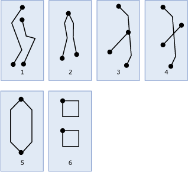

# MultiLineString
[!INCLUDE[appliesto-ss-asdb-xxxx-xxx-md](../../includes/appliesto-ss-asdb-xxxx-xxx-md.md)]
  A **MultiLineString** is a collection of zero or more **geometry** or **geographyLineString** instances.  
  
## MultiLineString instances  
 The illustration below shows examples of **MultiLineString** instances.  
  
   
  
 As shown in the illustration:  
  
-   Figure 1 is a simple **MultiLineString** instance whose boundary is the four endpoints of its two **LineString** elements.  
  
-   Figure 2 is a simple **MultiLineString** instance because only the endpoints of the **LineString** elements intersect. The boundary is the two non-overlapping endpoints.  
  
-   Figure 3 is a nonsimple **MultiLineString** instance because the interior of one of its **LineString** elements is intersected. The boundary of this **MultiLineString** instance is the four endpoints.  
  
-   Figure 4 is a nonsimple, nonclosed **MultiLineString** instance.  
  
-   Figure 5 is a simple, nonclosed **MultiLineString**. It is not closed because its **LineStrings** elements are not closed. It is simple because none of the interiors of any of the **LineStrings** instances intersect.  
  
-   Figure 6 is a simple, closed **MultiLineString** instance. It is closed because all its elements are closed. It is simple because none of its elements intersect at the interiors.  
  
### Accepted instances  
 For a **MultiLineString** instance to be accepted it must either be empty or comprised of only **LineString** intances that are accepted. For more information on accepted **LineString** instances, see [LineString](../../relational-databases/spatial/linestring.md). The following are examples of accepted **MultiLineString** instances.  
  
```sql  
DECLARE @g1 geometry = 'MULTILINESTRING EMPTY';  
DECLARE @g2 geometry = 'MULTILINESTRING((1 1, 3 5), (-5 3, -8 -2))';  
DECLARE @g3 geometry = 'MULTILINESTRING((1 1, 5 5), (1 3, 3 1))';  
DECLARE @g4 geometry = 'MULTILINESTRING((1 1, 3 3, 5 5),(3 3, 5 5, 7 7))';  
```  
  
The following example throws a `System.FormatException` because the second **LineString** instance is not valid.  
  
```sql  
DECLARE @g geometry = 'MULTILINESTRING((1 1, 3 5),(-5 3))';  
```  
  
### Valid instances  
For a **MultiLineString** instance to be valid it must meet the following criteria:  
  
1.  All instances comprising the **MultiLineString** instance must be valid **LineString** instances.  
  
2.  No two **LineString** instances comprising the **MultiLineString** instance may overlap over an interval. The **LineString** instances can only intersect or touch themselves or other **LineString** instances at a finite number of points.  

The following example shows three valid **MultiLineString** instances and one **MultiLineString** instance that is not valid.  
  
```sql  
DECLARE @g1 geometry = 'MULTILINESTRING EMPTY';  
DECLARE @g2 geometry = 'MULTILINESTRING((1 1, 3 5), (-5 3, -8 -2))';  
DECLARE @g3 geometry = 'MULTILINESTRING((1 1, 5 5), (1 3, 3 1))';  
DECLARE @g4 geometry = 'MULTILINESTRING((1 1, 3 3, 5 5),(3 3, 5 5, 7 7))';  
SELECT @g1.STIsValid(), @g2.STIsValid(), @g3.STIsValid(), @g4.STIsValid();  
```  
  
`@g4` is not valid because the second **LineString** instance overlaps the first **LineString** instance at an interval. They touch at an infinite number of points.  
  
## Examples  
The following example creates a simple `geometry``MultiLineString` instance containing two `LineString` elements with the SRID 0.  
  
```sql  
DECLARE @g geometry;  
SET @g = geometry::Parse('MULTILINESTRING((0 2, 1 1), (1 0, 1 1))');  
```  
  
To instantiate this instance with a different SRID, use `STGeomFromText()` or `STMLineStringFromText()`. You can also use `Parse()` and then modify the SRID, as shown in the following example.  
  
```sql  
DECLARE @g geometry;  
SET @g = geometry::Parse('MULTILINESTRING((0 2, 1 1), (1 0, 1 1))');  
SET @g.STSrid = 13;  
```  
  
## See Also  
 [STLength &#40;geometry Data Type&#41;](../../t-sql/spatial-geometry/stlength-geometry-data-type.md)   
 [STIsClosed &#40;geometry Data Type&#41;](../../t-sql/spatial-geometry/stisclosed-geometry-data-type.md)   
 [LineString](../../relational-databases/spatial/linestring.md)   
 [Spatial Data &#40;SQL Server&#41;](../../relational-databases/spatial/spatial-data-sql-server.md)  
  
  
