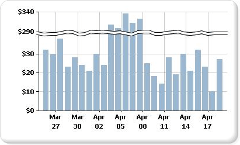

# Displaying a Series with Multiple Data Ranges on a Chart

  Chart will use the minimum and maximum values of a series to calculate the axis scale. When a series on your chart contains more than one range of data, the data points can become obscured, and only a few data points to be seen easily on the chart. For example, suppose a report displays daily sales totals over a period of 30 days.  
  
   
  
 For most of the month, the sales are between 10 and 40. However, a one-week sales marketing campaign has caused a sudden sales increase at the beginning of April. This change in sales data produces an uneven distribution of data points that reduces the overall readability of the chart.  
  
 There are different ways to improve readability:  
  
-   **Enable scale breaks**. If your data forms two or more sets of data ranges, use a scale break to remove the gap between the ranges. A scale break is a stripe drawn across the plotting area to denote a break between the high and low values of a series.  
  
-   **Filter out unnecessary values**. If you have data points that are obscuring the important data range to be displayed on the chart, remove the unwanted points using a report filter. For information on how to add a filter to the chart in [!INCLUDE[ssRSnoversion](../../includes/ssrsnoversion-md.md)], see [Add Dataset Filters, Data Region Filters, and Group Filters &#40;Report Builder and SSRS&#41;](../../reporting-services/report-design/add-dataset-filters-data-region-filters-and-group-filters.md).  
  
-   **Plot each data range as a separate series for multiple series comparison**. If you have more than two data ranges, consider separating the data ranges into separate series. For more information, see [Multiple Series on a Chart &#40;Report Builder and SSRS&#41;](../../reporting-services/report-design/multiple-series-on-a-chart-report-builder-and-ssrs.md).  
  
> [!NOTE]  
>  [!INCLUDE[ssRBRDDup](../../includes/ssrbrddup-md.md)]  
  
## Displaying Multiple Data Ranges Using Scale Breaks  
 When you enable a scale break, the chart calculates where to draw a line across the chart. You must have sufficient separation between ranges to draw a scale break. By default, a scale break can be added only if there is a separation between the data ranges of at least 25% of the chart.  
  
   
  
> [!NOTE]  
>  You cannot specify where to place a scale break on a chart. You can, however, modify how the scale break is calculated, described later in this topic.  
  
 If you enable a scale break but it does not appear, even though there is sufficient distance between the data ranges, you can set the CollapsibleSpaceThreshold property to a value less than 25. The CollapsibleSpaceThreshold specifies the percent of collapsible space required between the data ranges. For more information, see [Add Scale Breaks to a Chart &#40;Report Builder and SSRS&#41;](../../reporting-services/report-design/add-scale-breaks-to-a-chart-report-builder-and-ssrs.md).  
  
 Charts support up to five scale breaks per chart; however, displaying more than one scale break can cause the chart to become unreadable. If you have more than two data ranges, consider using a different method for displaying this data. For more information, see [Multiple Series on a Chart &#40;Report Builder and SSRS&#41;](../../reporting-services/report-design/multiple-series-on-a-chart-report-builder-and-ssrs.md).  
  
## Unsupported Scale Break Scenarios  
 Scale breaks are not supported in the following chart scenarios:  
  
-   The chart is 3-D enabled.  
  
-   A logarithmic value axis has been specified.  
  
-   The value axis minimum or maximum has been explicitly set.  
  
-   The chart type is polar, radar, pie, doughnut, funnel, pyramid, or any stacked chart.  
  
 An example of chart with scale breaks is available as a sample report. For more information about downloading this sample report and others, see [Report Builder and Report Designer sample reports](https://go.microsoft.com/fwlink/?LinkId=198283).  

## Next steps

[Multiple Series on a Chart](../../reporting-services/report-design/multiple-series-on-a-chart-report-builder-and-ssrs.md)   
[Formatting a Chart](../../reporting-services/report-design/formatting-a-chart-report-builder-and-ssrs.md)   
[3D, Bevel, and Other Effects in a Chart](../../reporting-services/report-design/chart-effects-3d-bevel-and-other-report-builder.md)   
[Charts](../../reporting-services/report-design/charts-report-builder-and-ssrs.md)   
[Axis Properties Dialog Box, Axis Options](https://msdn.microsoft.com/library/b276e210-7a12-48ae-971b-7dabae51df11)   
[Collect Small Slices on a Pie Chart](../../reporting-services/report-design/collect-small-slices-on-a-pie-chart-report-builder-and-ssrs.md)  

More questions? [Try asking the Reporting Services forum](https://go.microsoft.com/fwlink/?LinkId=620231)
