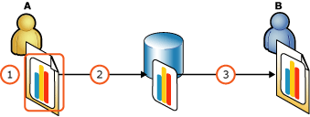

# Report Parts in Report Designer (SSRS)

  In Report Designer, after you create tables, charts, and other paginated report items in a project, you can publish them as *report parts* to a report server or SharePoint site integrated with a report server so that you and others can reuse them in other reports.  
  
 In general, report parts function the same way in Report Designer and in Report Builder. To read about basic functionality, see [Report Parts &#40;Report Builder and SSRS&#41;](../../reporting-services/report-design/report-parts-report-builder-and-ssrs.md).  
  
 There are fundamental differences in the way report parts work in Report Designer. A main difference is the work flow. Report Builder enables collaborative authoring: I create a report part and publish it. You can reuse, modify, and republish it. In Report Designer, publishing is one-way: I can publish a report part from Report Designer, and you can reuse it. But I cannot reuse an existing report part in a report in Report Designer. This topic elaborates on these differences, after a quick overview of report parts.  
  
##   Life Cycle of Report Part Publishing  
   
  
1.  In Report Designer, Person A creates a project that contains a report with a chart that depends on an embedded dataset.  
  
2.  Person A flags the chart with its embedded dataset for publishing. Report Designer assigns it a unique ID. Person A then deploys the report to the report server. Report Designer publishes the chart.  
  
3.  Person B creates a blank report in Report Builder and adds the chart to it. The chart is now part of Person B's report, along with the embedded dataset. Person B can modify the instances of the chart and dataset that are in the report. This will have no effect on the instances of the chart and dataset on the report server, nor will it break the relationship between the instances in the report and on the report server.  
  
       
  
4.  In Report Designer, Person A modifies the chart in the original report.  
  
5.  Person A redeploys the report, which republishes the chart to the server, thus updating the chart on the server.  
  
6.  In Report Builder, Person B accepts the updated chart from the server. This overwrites the changes that Person B had made to the chart in Person B's report.  
  
##   Publishing Report Parts  
 When you publish a report part, Report Designer assigns it a unique ID. From then on, it maintains that ID, no matter what else you change about it. The ID links the original report item in your report to the report part. When other report authors reuse the report part in Report Builder, the ID also links the report part in their report to the report part.  
  
 These are the report items you can publish as report parts:  
  
-   Charts  
  
-   Gauges  
  
-   Images and embedded images  
  
-   Maps  
  
-   Parameters  
  
-   Rectangles  
  
-   Tables  
  
-   Matrices  
  
-   Lists  
  
 If you are publishing a report part that displays data, such as a table, matrix, or chart, you can base it on a shared dataset; otherwise, when you publish the report part, the dataset that it depends on is saved as an embedded dataset. Embedded datasets can be based on embedded data sources, but credentials are not stored in embedded data sources. Thus, if your report part depends on an embedded dataset that uses an embedded data source, anyone who reuses this report part will need to provide the credentials for the embedded data source. To avoid this, base your embedded and shared datasets on shared data sources with stored credentials. For more information, see [Report Parts and Datasets in Report Builder](../../reporting-services/report-data/report-parts-and-datasets-in-report-builder.md).  
  
 Publishing a report part in Report Designer is a two-step process:  
  
1.  Flag the report items that you want to publish in the **Publish Report Parts** dialog box.  
  
2.  Deploy the report.  
  
 When you deploy the report, the report part is published to a SharePoint site or report server, and others can reuse it. To publish a report part, you must have a connection to and sufficient permissions on a report server when you deploy the report.  
  
  
##   Reusing Report Parts  
 Unlike in Report Builder, you cannot search for and reuse a report part in a project other than the one in which it was created.  
  
 Report authors working in Report Builder can search for and reuse report parts that you publish in reports that they create.  
  
##   Republishing Report Parts  
 In Report Designer, you should update an existing report part from within the report in which you created it. In Report Builder, report authors can reuse the report part, and publish it as a new report part without replacing the report part that you published. If they have sufficient permissions they can also update the report part that you published. Anyone with sufficient permissions for a folder on a site or server can update the report parts stored there. The last update overwrites previous updates.  
  
 You can modify and then republish the report part to the site or server. Report Builder report authors who have added that report part to a report are informed of the change the next time they open that report. They can choose to accept your changes or not.  
  
 You can also choose to publish as new a report that you have already published. In the Publish Report Parts dialog box, click the Publish as a new report part. This new report part has a new unique ID and no relationship to the old report part.  

## Next steps

[Managing Report Parts](../../reporting-services/report-design/managing-report-parts.md)  

More questions? [Try asking the Reporting Services forum](https://go.microsoft.com/fwlink/?LinkId=620231)
