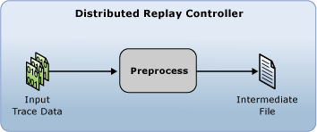

# Prepare the Input Trace Data

[!INCLUDE[appliesto-ss-xxxx-xxxx-xxx-md](../../includes/appliesto-ss-xxxx-xxxx-xxx-md.md)]

Before you can start a distributed replay with the [!INCLUDE[msCoName](../../includes/msconame-md.md)] [!INCLUDE[ssNoVersion](../../includes/ssnoversion-md.md)] Distributed Replay feature, you must prepare the input trace data by initiating the preprocess stage from the distributed replay administration tool. In the preprocess stage, the distributed replay controller processes the trace data and generates an intermediate file:  
  
   
  
 For more information about the preprocess stage, see [SQL Server Distributed Replay](../../tools/distributed-replay/sql-server-distributed-replay.md).  
  
> [!NOTE]  
>  The input trace data must be captured in a version of [!INCLUDE[ssNoVersion](../../includes/ssnoversion-md.md)] that is compatible with Distributed Replay. The input trace data must also be compatible with the target server that you want to replay the trace data against. For more information about version requirements, see [Distributed Replay Requirements](../../tools/distributed-replay/distributed-replay-requirements.md).  
  
### To prepare the input trace data  
  
1.  **(Optional) Modify preprocess configuration settings**: If you want to modify the preprocess configuration settings, such as whether to filter system sessions or to configure the maximum idle time, you must modify the `<PreprocessModifiers>` element of the XML-based preprocess configuration file, `DReplay.exe.preprocess.config`. If you modify the preprocess configuration file, we recommend that you modify a copy rather than the original. To modify settings, follow these steps:  
  
    1.  Make a copy of the default preprocess configuration file, `DReplay.exe.preprocess.config`, and rename the new file. The default preprocess configuration file is located in the administration tool installation folder.  
  
    2.  Modify the preprocess configuration settings in the new configuration file.  
  
    3.  When initiating the preprocess stage (the next step), use the *config_file* parameter of the **preprocess** option to specify the location of the modified configuration file.  
  
     For more information about the preprocess configuration file, see [Configure Distributed Replay](../../tools/distributed-replay/configure-distributed-replay.md).  
  
2.  **Initiate the preprocess stage**: To prepare the input trace data, you must run the administration tool with the **preprocess** option. For more information, see [Preprocess Option &#40;Distributed Replay Administration Tool&#41;](../../tools/distributed-replay/preprocess-option-distributed-replay-administration-tool.md).  
  
    1.  Open the Windows Command Prompt utility (**CMD.exe**), and navigate to the installation location of the Distributed Replay administration tool (**DReplay.exe**).  
  
    2.  (Optional) Use the *controller* parameter, **-m**, to specify the controller, if the controller service is running on a computer different from the administration tool.  
  
    3.  Use the *input_trace_file* parameter, **-i**, to specify the location and name of the input trace files.  
  
    4.  Use the *controller_working_directory* parameter, **-d**, to specify where the intermediate file should be saved on the controller.  
  
    5.  (Optional) Use the *config_file* parameter, **-c**, to specify location of the preprocess configuration file. Use this parameter to point to the new configuration file if you have modified a copy of the default preprocess configuration file.  
  
    6.  (Optional) Use the *status_interval* parameter, **-f**, to specify if you want the administration tool to display status messages at a frequency different than 30 seconds.  
  
     For example, initiating the preprocess stage on the same computer as the controller service, for a trace file located at `c:\trace1.trc`, a controller working directory located at `c:\WorkingDir` , and a status message displayed at the default value of 30 seconds, requires the syntax: `dreplay preprocess -i c:\trace1.trc -d c:\WorkingDir`  
  
3.  After the preprocess stage is complete, the intermediate file is stored in the controller working directory. To initiate the event replay stage, you must run the administration tool with the **replay** option. For more information, see [Replay Trace Data](../../tools/distributed-replay/replay-trace-data.md).  
  
## See Also  
 [SQL Server Distributed Replay](../../tools/distributed-replay/sql-server-distributed-replay.md)   
 [Distributed Replay Requirements](../../tools/distributed-replay/distributed-replay-requirements.md)   
 [Administration Tool Command-line Options &#40;Distributed Replay Utility&#41;](../../tools/distributed-replay/administration-tool-command-line-options-distributed-replay-utility.md)   
 [Configure Distributed Replay](../../tools/distributed-replay/configure-distributed-replay.md)  
  
  
