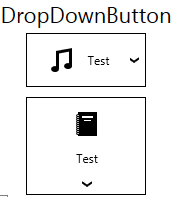

Title: DropDownButton
Description: A Button with a drop down menu
---

  

This control is almost the same as the [SplitButton](splitbutton) with few differences:

- It has no `SelectedItem` and `SelectedIndex` properties and also has no `SelectionChanged` event.
- The content of the button also doesn't change, it's static.
- The Dropdownlist is a context menu instead of Listbox in `SplitButton`.

In all other aspects it's identical to [SplitButton](splitbutton).

```xml
<mah:DropDownButton Margin="5"
                    Command="{Binding ArtistsDropDownCommand}"
                    Content="Artists"
                    DisplayMemberPath="Name"
                    ItemsSource="{Binding Source={x:Static models:SampleData.Artists}}">
    <mah:DropDownButton.Icon>
        <iconPacks:PackIconMaterial Margin="6" Kind="Artist" />
    </mah:DropDownButton.Icon>
</mah:DropDownButton>
```

  

Internally, the items are stored in a ContextMenu that is executed when the button is clicked. If you want to do something when an item is clicked, you have to define a command that is attached to the item.

One way of doing this is setting the `ItemContainerStyle`:

```xml
<mah:DropDownButton Margin="5"
                    Content="Genres"
                    DisplayMemberPath="Name"
                    ItemsSource="{Binding Source={x:Static models:SampleData.Genres}}">
    <mah:DropDownButton.ItemContainerStyle>
        <Style BasedOn="{StaticResource {x:Type MenuItem}}" TargetType="{x:Type MenuItem}">
          <Setter Property="Command" Value="{Binding RelativeSource={RelativeSource FindAncestor, AncestorType={x:Type mah:DropDownButton}}, Path=DataContext.GenreDropDownMenuItemCommand}" />
          <Setter Property="CommandParameter" Value="{Binding Name}" />
        </Style>
    </mah:DropDownButton.ItemContainerStyle>
    <mah:DropDownButton.Icon>
        <iconPacks:PackIconMaterial Margin="6" Kind="Audiobook" />
    </mah:DropDownButton.Icon>
</mah:DropDownButton>
```

Each `MenuItem` has one item from the `ItemsSource` as DataContext, which we can access here. Therefore, `{Binding Name}` will show the name of the genre. To break out of the current `DataContext` and call the command from our original ViewModel, we need to reference it in some way. Here, we search for the `DropDownButton`.
