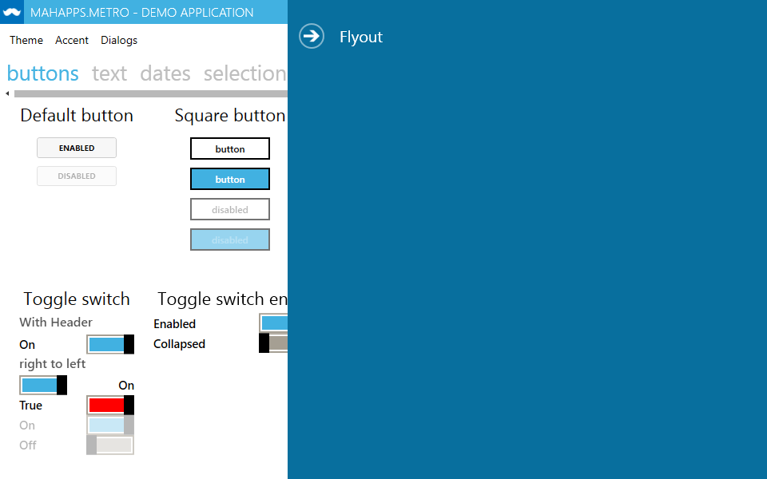

Title: Flyouts
Description: An overlay control that can slide in and render custom contents
---

A `Flyout` is an overlay for the [MetroWindow](metrowindow) that can render custom contents.
It's derived from `HeaderedContentControl` and has the ability to slide in and out from any side of the window.

:::{.alert .alert-info}
***Note***  
It's strongly recommended to use any `Flyout` within the `FlyoutsControl`.
:::

## FlyoutsControl

The `FlyoutsControl` is an `ItemsControl` which contains all `Flyout` items for one `MetroWindow`. It must be assigned to the `Flyouts` property of the [MetroWindow](metrowindow).

## Example

The following Xaml code creates two `Flyout` controls with a header and the position on the right side of the window.
To open or close a `Flyout` set the `IsOpen` property or use a property on your ModelView at the DataContext of the window.

```xml
<mah:MetroWindow.Flyouts>
    <mah:FlyoutsControl>
      <mah:Flyout x:Name="FirstFlyout" Header="Settings" Position="Right" Width="250">
          <!-- The content goes here -->
      </mah:Flyout>

      <mah:Flyout Header="About" IsOpen="{Binding IsAboutFlyoutOpen}" Position="Right" Width="300">
          <!-- The content goes here -->
      </mah:Flyout>
    </mah:FlyoutsControl>
</mah:MetroWindow.Flyouts>
```


## Position enum

Specifies the position fo the `Flyout`.

| Value  |   | Description                           |
|--------|---|---------------------------------------|
| Left   | 0 | Shows the `Flyout` on the left side.  |
| Right  | 1 | Shows the `Flyout` on the right side. |
| Top    | 2 | Shows the `Flyout` on the top.        |
| Bottom | 3 | Shows the `Flyout` on the bottom.     |

## FlyoutTheme enum

Specifies how a `Flyout` is being themed.

### Fields

| Value   |   | Description                              |
|---------|---|------------------------------------------|
| Adapt   | 0 | Adapts the `Flyout` theme to the theme of the host window or application. |
| Inverse | 1 | Adapts the `Flyout` theme to the theme of the host window or application, but inverted. This theme can only be applied if the host window's theme abides the `Dark` and `Light` affix convention. |
| Dark    | 2 | Use the dark theme for the `Flyout`. This is the default theme. |
| Light   | 3 | Use the light theme for the `Flyout`.    |
| Accent  | 4 | The `Flyout` theme will match the host window's accent color. This option needs more action by the user, such as using the correct Foreground for the controls inside the `Flyout`. |



## Overlay Behavior

The overlay behavior properties of the `MetroWindow` sets the visibility of the `Icon`, `LeftWindowCommands`, `RightWindowCommands` and `WindowButtonCommands` when a Flyout is shown.

### MetroWindow Properties

| Property                            | Type                          | Description                              |
|-------------------------------------|-------------------------------|------------------------------------------|
| LeftWindowCommandsOverlayBehavior   | WindowCommandsOverlayBehavior | Gets or sets the overlay behavior for the `WindowCommands` on the left side of the title bar. |
| RightWindowCommandsOverlayBehavior  | WindowCommandsOverlayBehavior | Gets or sets the overlay behavior for the `WindowCommands` on the right side of the title bar. |
| WindowButtonCommandsOverlayBehavior | OverlayBehavior               | Gets or sets the overlay behavior for the `WindowButtonCommands` (Min / Max / Restore / Close) on the title bar. |
| IconOverlayBehavior                 | OverlayBehavior               | Gets or sets the overlay behavior for the icon on the title bar. |

:::{.alert .alert-info}
***Note***  
The `LeftWindowCommands`, `RightWindowCommands` and the `Icon` will never be shown over an opened `Flyout`.
:::

## WindowCommandsOverlayBehavior enum

Specifies the visibility of the `WindowCommands`.

### Fields

| Value          | Description                              |
|----------------|------------------------------------------|
| Never          | The `WindowCommands` will never be shown over a `Flyout` or hidden title bar. |
| HiddenTitleBar | The `WindowCommands` will be shown even if a title bar is hidden. |

## OverlayBehavior enum

Specifies the visibility of the `WindowButtonCommands` (Min, Max/Restore and Close Buttons) and the `Icon`.

### Fields

| Value          | Description                              |
|----------------|------------------------------------------|
| Never          | The `WindowButtonCommands` or the icon will never be shown over a `Flyout` or hidden title bar. |
| Flyouts        | The `WindowButtonCommands` or the icon overlays all opened `Flyout`. |
| HiddenTitleBar | The `WindowButtonCommands` or the icon will be shown even if a title bar is hidden. |
| Always         | The `WindowButtonCommands` or the icon will always be shown. |
