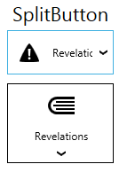
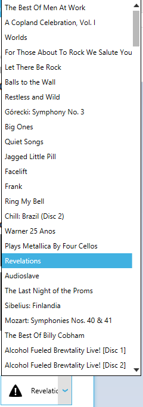

Title: SplitButton
---

  

The `SplitButton` controls is like a button with a drop down list, but the content of the button will be changed when selected item is changed.

### SelectedItem and SelectedIndex

This properties usage is just like in Listbox or ComboBox. When one of this properties changed, Content of the button will also changed.

### Binding to `ObservableCollection` or `Dictionary`

To correctly bind an `ObservableCollection` or a `Dictionary` to `SplitButton`, you need to use `ItemsSource` and `DisplayMemberPath`
For ex, `ItemsSource="{Binding Albums}" DisplayMemberPath="Title"`
In case you bind simple types like an enum or integer, you don't need to use `DisplayMemberPath` property, only `ItemsSource`.

### Orientation

SplitButton supports orientation changing as you can see on the screenshot.

### Button commands

You can use button commands for SplitButton

### Icon property

You can add separate icon to SplitButton to display it independently from its content.

```xml
<mah:SplitButton Margin="5"
                 HorizontalContentAlignment="Left"
                 Command="{Binding ArtistsDropDownCommand}"
                 DisplayMemberPath="Name"
                 ItemsSource="{Binding Source={x:Static models:SampleData.Artists}}"
                 SelectedIndex="2"
                 SelectionChanged="SplitButton_OnSelectionChanged">
    <mah:SplitButton.Icon>
        <iconPacks:PackIconMaterial Margin="6" Kind="Audiobook" />
    </mah:SplitButton.Icon>
</mah:SplitButton>
```
								

